# 如何将代码等文件导入github中  

1.首先在文件夹中右键选择 **Open Git Bash here**.

2.输入 **git init**进行初始化.
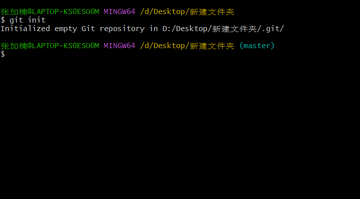  

3.创建仓库

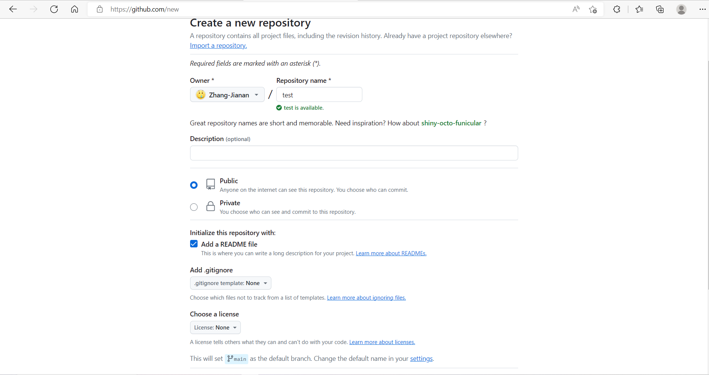  

4.利用 **git remote add origin 远程仓库的url** 来建立连接

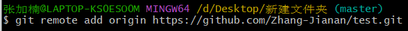  

​    之后利用**git remote -v**查看是否成功

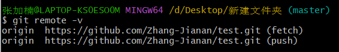  

5.利用**ssh-keygen -t rsa** 生成密钥并且从中找到密钥储存位置

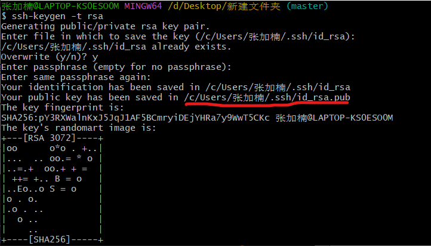  

6.之后单击github中的个人头像并且找到 **SSH and GPG keys**这一栏，选择加入新的SSH key，并且输入对应的密钥

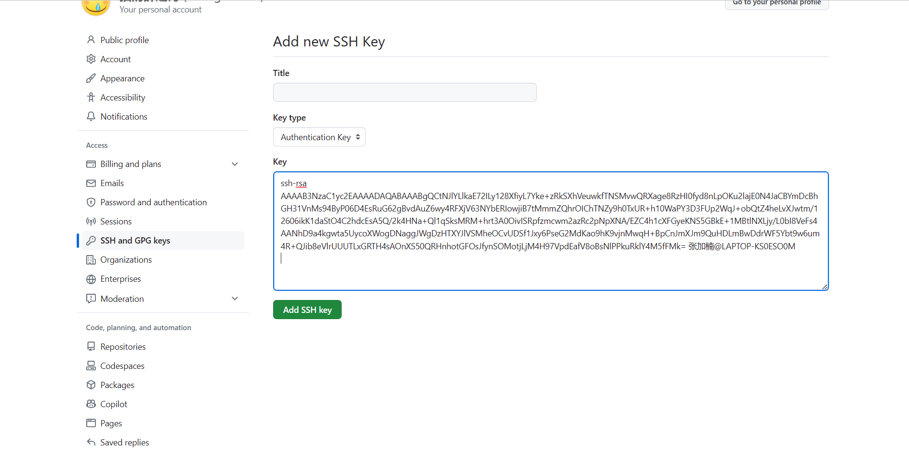  

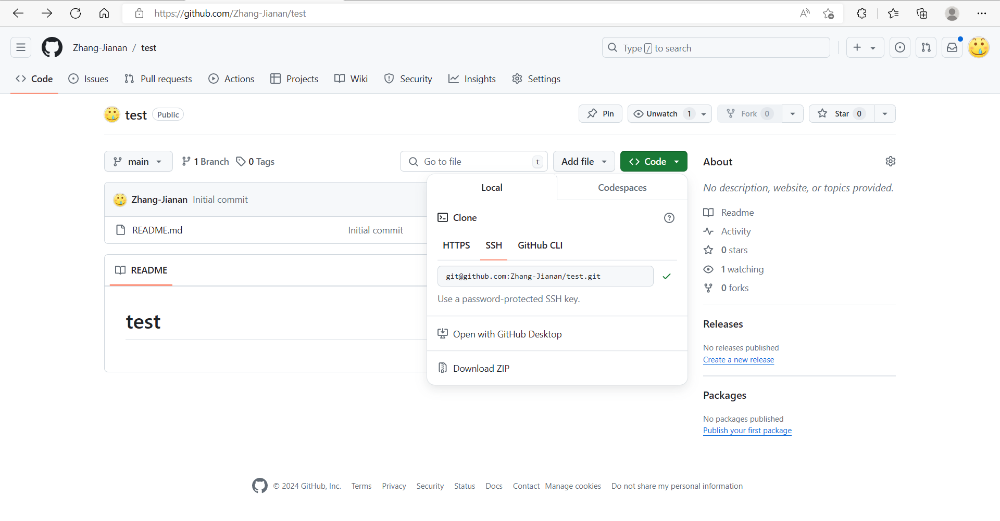  

7.输入**git clone 仓库的SSH**

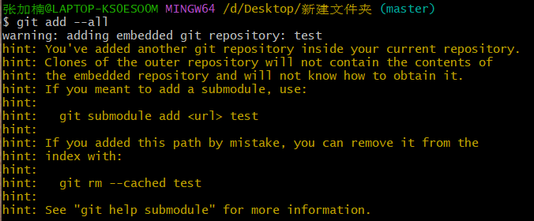  

#### **更新仓库从这里开始**

8.最后输入**git add --all**添加信息

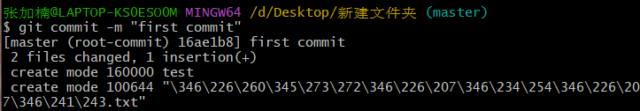  

输入**git commit -m "    "**来提交代码并更新信息

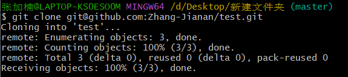  

输入 **git push origin master**来更新仓库

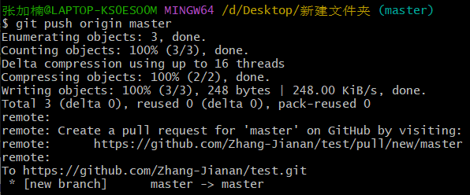  

8.在仓库的设置界面更改默认分支即可

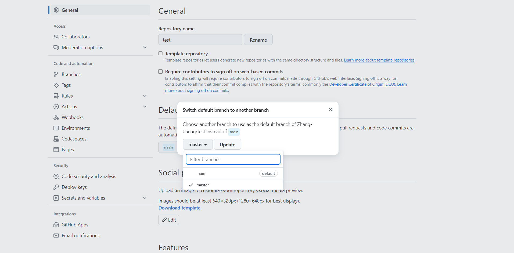  

## 

